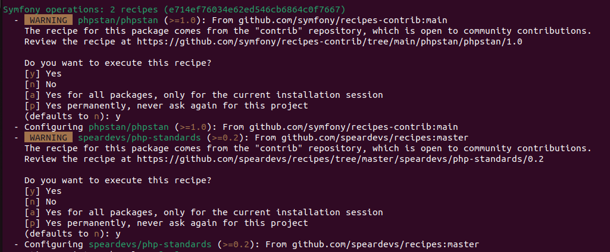

# Speardevs PHP Standards

## Features

Speardevs PHP Standards package contains:

* PHPStan
* Easy Coding Standard
* Rector
* PHPUnit
* GitHub Action workflow

## Installation

### Configure `composer.json`

```json
{
    "extra": {
        "symfony": {
            "endpoint": [
                "https://api.github.com/repos/speardevs/recipes/contents/index.json",
                "flex://defaults"
            ]
        }
    },
    "repositories": [
        {
            "type": "vcs",
            "url": "git@github.com:SpearDevs/php-standards.git"
        }
    ]
}
```

### Install with Composer

```shell
composer require speardevs/php-standards --dev
```

### Allow to execute recipes



### Generate project composer token

Generate token [here](https://github.com/settings/tokens/new?scopes=repo&description=GitHub%20Actions%20Composer) and
create new GitHub Action's secret key `SPEARDEVS_PIPELINES_KEY` with generated token.

## Notes

### PHP

Default PHP version in package is defined as `8.2`. If adjustment is needed then update following files:

* `.github/workflows/speardevs-coding-standards.yaml` - set correct PHP version for `php-version` key
* `rector.php` - replace `LevelSetList::UP_TO_PHP_82` set list name with proper version;
  example: `LevelSetList::UP_TO_PHP_74`

### PHPStan

If amount of changes to apply is overwhelming, you
can [generate baseline](https://phpstan.org/user-guide/baseline) and then slowly improve code file by file.

### PHPUnit

If project has no implemented tests, comment `Run PHPUnit tests` step in pipeline defined
in `.github/workflows/speardevs-coding-standards.yaml` to pass correctly job.
